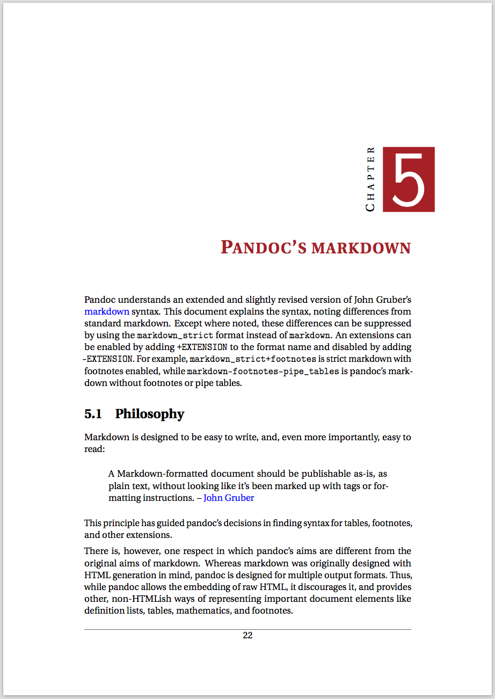

This is a memoir bootstrap package for `pandoc`, heavily inspired by [dataMineR].
It features a nice chapter style as well as bibliography and code support.
You need a working installation of `pandoc` to use this.

To create a pdf file from this text, simply call `make` inside this directory.
Adjust the makefile to your own needs.

[dataMineR]: https://github.com/hugokoopmans/dataMineR
